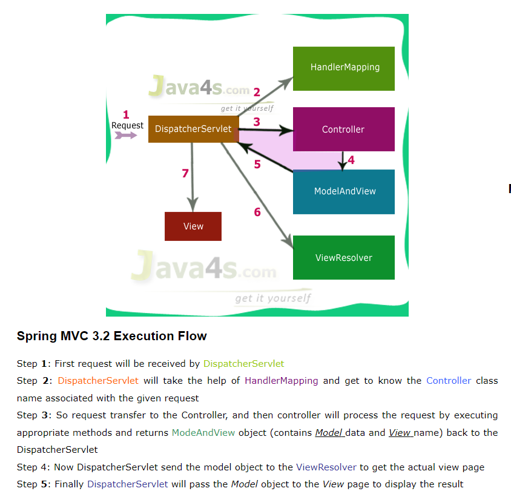
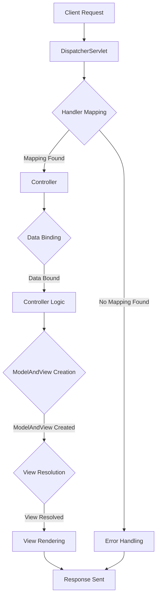
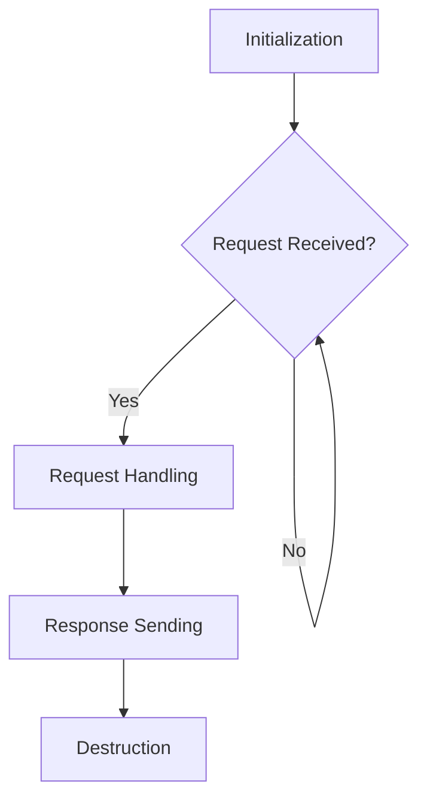
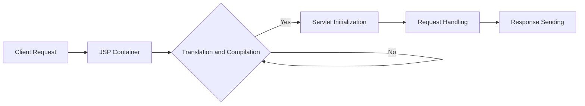

# SpringBoot: RESTful App using SPRING MVC and Thymeleaf

---

## Spring MVC

### Components of Spring MVC Application

1. **Web Browser**: Initiates requests to the server.
2. **Front Controller**: Handles incoming requests and dispatches them to appropriate handlers.
3. **MVC Controller**: Processes requests, interacts with the model, and selects view templates.
4. **Model (Spring Model)**: Represents data used by the application, interacts with the business logic.
5. **View Template**: Generates the user interface, often using a templating engine like Thymeleaf.

### How does it work and workflow explanation?

Spring MVC is a framework for building web applications based on the Model-View-Controller architecture.

- **Client Request**: Initiated by the web browser.
- **DispatcherServlet**: Front controller that receives the request.
- **Handler Mapping**: Maps the request to an appropriate controller.
- **Controller Processing**: Executes the controller logic, interacts with the model.
- **Model Update**: Updates the model with required data.
- **View Resolution**: Selects the appropriate view template.
- **View Rendering**: Renders the view using data from the model.
- **Response Sent**: Generated view is sent back to the client.

### Data Binding in Spring MVC

- **Data Binding**: Process of mapping request parameters to Java objects.
- **@ModelAttribute**: Binds request parameters to model attributes.
- **@RequestParam**: Binds request parameters to method parameters.
- **BindingResult**: Holds validation errors.

## Java's Standard Bean Validation API

- **javax.validation**: Provides annotations for declarative validation.
- **@NotNull, @Size, @Min, @Max**: Commonly used validation annotations.
- **BindingResult**: Captures validation errors during data binding.

## Thymeleaf

### What is Thymeleaf?

- **Template Engine**: Enables server-side rendering of HTML pages.
- **Natural Templates**: HTML files that can be opened in a browser directly.
- **Integration with Spring MVC**: Seamless integration with Spring MVC.
- **Feature-rich**: Supports expression language, iteration, conditionals, etc.

### How does it work?

- **Markup Processor**: Parses HTML documents with embedded Thymeleaf attributes.
- **Expression Evaluation**: Evaluates Thymeleaf expressions and replaces them with data.
- **Template Resolvers**: Loads and resolves template files from various sources.
- **Context Variables**: Provides data to templates using model attributes.

### Its alternatives?

- **FreeMarker**: Another popular template engine for Java web applications.
- **Velocity**: Deprecated but still used in legacy projects.
- **Handlebars**: Provides logic-less templates, simpler syntax.

## Servlets

Servlets are Java classes that dynamically process requests and generate responses for web applications.

- **Java Servlet API**: Provides a way to handle requests on the server.
- **Servlet Lifecycle**: Initialized, Service, Destroyed.
- **javax.servlet.Servlet**: Interface for all servlets.
- **HttpServletRequest, HttpServletResponse**: Represents request and response objects.

### Working of Servlets

#### Request Handling

1. **Client Request**: Initiates an HTTP request to the servlet.
2. **Servlet Container**: Receives the request and invokes the appropriate servlet.
3. **Servlet Processing**: Servlet processes the request, performs required logic, and generates a response.
4. **Response Sending**: Sends the response back to the client.

#### Servlet Lifecycle

Servlet Lifecycle Flow Chart

1. **Initialization**: Servlet is loaded and initialized by the servlet container.
2. **Request Handling**: Handles client requests by executing `service()` method.
3. **Destruction**: Servlet is removed from memory when no longer needed.

#### Key Servlet Interfaces and Classes

- `javax.servlet.Servlet`: Interface implemented by all servlets.
- `javax.servlet.http.HttpServlet`: Abstract class providing methods to handle HTTP requests.
- `javax.servlet.ServletRequest`: Represents the client's request.
- `javax.servlet.ServletResponse`: Represents the servlet's response to the client.

## Java Server Pages (JSP)

JSP is a technology used to create dynamic web content by embedding Java code within HTML pages.

- **JSP Technology**: Used to create dynamic web content.
- **Mix of HTML and Java**: Allows embedding Java code within HTML.
- **JSP Lifecycle**: Translation, Compilation, Execution.
- **Implicit Objects**: Request, Response, Session, Application, etc.

### Working of JSP

#### Translation and Compilation

1. **JSP File**: Contains HTML and Java code.
2. **Translation**: JSP file is translated into a servlet by the JSP compiler.
3. **Compilation**: Generated servlet is compiled into bytecode.

#### Execution

1. **Servlet Initialization**: Servlet corresponding to the JSP is loaded and initialized.
2. **Request Handling**: Servlet processes client requests by executing Java code and generating dynamic content.
3. **Response Sending**: Generated HTML content is sent back to the client.

### Key JSP Elements

- **Scriptlets**: Java code embedded within `<% %>` tags.
- **Directives**: Instructions to the JSP container, such as `page`, `include`, and `taglib`.
- **Expressions**: Dynamic values inserted into HTML using `${}`.
- **Declarations**: Variable and method declarations using `<%! %>`.

### Flow Chart: JSP Execution

1. **Client Request**: Initiates an HTTP request to the JSP page.
2. **JSP Container**: Translates the JSP into a servlet and compiles it.
3. **Servlet Initialization**: Servlet corresponding to the JSP is loaded and initialized.
4. **Request Handling**: Servlet executes Java code and generates dynamic content.
5. **Response Sending**: Generated HTML content is sent back to the client.